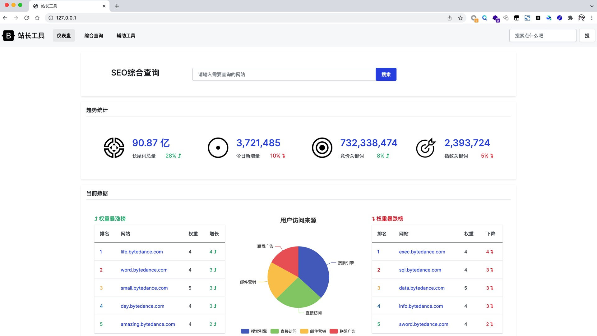

# 部署靶场

```bash
git clone https://github.com/sqlsec/ByteCTF2021-Final-SEO.git
cd ByteCTF2021-Final-SEO/Dockerfile
docker-compose up -d
```

默认占用外网的  80 端口，内网的网段为 172.73.23.1/24，如有冲突请自行更改。



# 攻击思路

1. 找到含义 SSRF 的漏洞接口，绕过前端校验，可以直接扫描探测内网信息。

2. 为了快速定位内网的网段，网站还预留的文件下载漏洞，可以通过文件下载 hosts 之类的文件，拿到当前网段的信息。
3. 使用 SSRF 漏洞的接口，通过 gopher 协议攻击内网的 MySQL 服务器，使用 UDF 提权可以拿下内网 MySQL 权限
4. 内网 MySQL 根目录下存放着 flag，直接 UDF 命令执行读取即可

# 题目亮点

1. 前端功能场景尽量模拟了真实的 SSRF 漏洞情况
2. 通过 JS 去请求 API 接口，比较符合目前主流的开发场景
3. 多个没有 SSRF 漏洞的干扰接口，需要选手耐心去过一些这些接口
4. 配合文件下载漏洞可以快速定位内网服务器的当前网段
5. 考察选手 SSRF 在内网中的实际信息收集，需要选手自己去找到内网的 MySQL 资产
6. 考察选手 MySQL 的攻击思路，这里只要考擦使用 SSRF 进行内网 MySQL 的 UDF 提权
7. Docker-compose 搭建，比赛的时候维护和修复会比较方便

